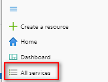
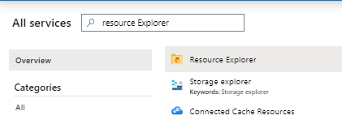
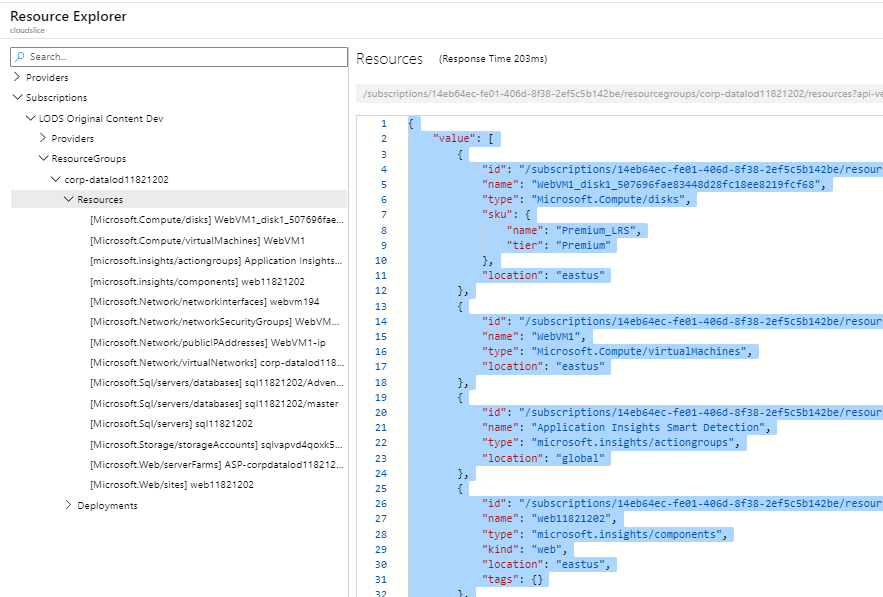
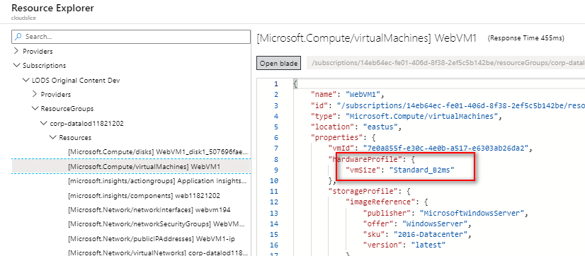

# Azure Access Control Policy Creation Process

This document provides basic information on the steps for creating a restrictive Access Control Policy (ACP) that limits a lab to only the resources it requires.

## Collect resource data

To create a restrictive policy that allows only the resources required for a lab, you must inventory and collect the resources that you create in Azure. To do this, when you get to the end of the lab steps, in the Azure portal,

1.  From the hamburger tab, select All services.  
    

2.  In the All Service search box, enter and select **Resource Explorer**.  
    

3.  In Resource Explorer, expand **Subscriptions**, expand the \[**subscription used in lab**\], expand **ResourceGroups**, expand \[**resource group used in lab**\], and select **Resources**.

4.  Select any area in the Resources pane to the right, and press **Ctrl+A** to select all the content, and then press **Ctrl+C** to copy all the contents to the clipboard.  
      
    

5.  Open a text editor and press Ctrl+V to copy the contents of the clipboard.

6.  If the resources list one or more VMs, select \[Microsoft.Compute/virtualMachines\]\[VMname\]  
    

7.  Make a note of the VM size.

8.  Repeat steps 6 and 7 for each VM in the resource group.

9.  Repeat steps 3 to 8 for each resource group used in the lab, if there are more than one.

10. For each resource group, append the resource information to the text file.

11. Save the text file with a descriptive name, such as **MOC20765C-Mod1-Resources.json**.

## Creating the ACP

The resources you collected earlier allow you to easily create a comprehensive but strict Access Control Policy by using using the model templates provided below and by following a few simple principles:

### Principles for ACP creation

-   Follow the principle of least privilege. In your ACP, explicitly allow ***only*** those resources required to perform the lab. You must follow this principle strictly for Microsoft.Compute resources, but you have some flexibility with other resources (see below).

-   You must **never** use an ACP in production that allows the creation of any and all resources under the Microsoft.Compute node. You must always specify exactly what resources are allowed under this node, for example, Microsoft.Compute/virtualmachines/extensions.

-   For labs that use Azure VMs, you ***must always*** restrict VM creation by VM Name and by SKU. Optionally, you should also restrict by region. Allowing some flexibility for region and SKU selection is permitted, but don't leave it wide open: allow only a handful of SKUs and regions.

-   For all other resources, it is acceptable to allow any resource to be created under the parent node. For example, consider a lab that uses the both Microsoft,Network/networkinterfaces and Microsoft.Network/networkSecurityGroups resources. You do not have tp explicitly allow both Microsoft.Network/networkinterfaces and Microsoft.Network/networkSecurityGroups. You can simply allow all resources to be created under this node (Microsft.Network).

-   If possible, do try to restrict resources by SKU if there is a risk of a significant impact if a user chooses a more expensive SKU than required by the lab.

### Creating an ACP for a lab that has no virtual machines

When an ACP does not require that you limit the virtual machine resources, you can use the following template as a model:

```json
{
    "if": {
        "not": {
            "anyOf": [                           
                {
                    "field": "type",
                    "contains": "Microsoft.Storage/storageAccounts"
                },
                {
                    "field": "type",
                    "contains": "Microsoft.Network"
                },
                {
                    "field": "type",
                    "contains": "Microsoft.Sql/servers"
                }
            ]
        }
    },
    "then": {
        "effect": "Deny"
    }
}

```

Examine the text file that contains an inventory of resources you saved earlier, and then replace or add the resources as appropriate to the Json code above.

### Creating an ACP for a lab that has an Azure VM

For labs that use Azure VMs, you ***must*** limit VM creation by name and by SKU (size). As well, you should limit by region. The following JSON provides the basic pattern you can use:

```Json
{
    "if": {
        "not": {
            "anyOf": [
                {
                    "allOf": [
                        {
                            "field": "type",
                            "equals": "Microsoft.Compute/virtualMachines"
                        },
                        {
                            "field": "Microsoft.Compute/virtualMachines/sku.name",
                            "in": [
                                "Standard_B2ms",
                                "Standard_D3_v2",
                                "Standard_DS3_v2"
                            ]
                        },
                        {
                            "field": "Microsoft.Compute/virtualMachines/osprofile.computername",
                            "in": [
                                "WebVM1"
                            ]
                        },
                        {
                            "field": "location",
                            "In": [
                                "eastus2",
                                "eastus"
                            ]
                        },
                        {
                            "field": "location",
                            "notEquals": "global"
                        }
                    ]
                },
            {
            "field": "type",
            "contains": "Microsoft.web/sites"
            },
            {
            "field": "type",
            "contains": "Microsoft.web/serverfarms"
            },
            {
            "field": "type",
            "contains": "Microsoft.Sql/servers"
            },
            {
            "field": "type",
            "contains": "Microsoft.Network"
            },
            {
            "field": "type",
            "contains": "Microsoft.Compute/disks"
            },
            {
            "field": "type",
            "contains": "Microsoft.Compute/virtualMachines/extensions"
            },
            {
            "field": "type",
            "contains": "Microsoft.Storage/storageaccounts"
            },
            {
            "field": "type",
            "contains": "Microsoft.Insights/"
            }
            ]
        }
    },
    "then": {
        "effect": "Deny"
    }
}

```

In this case, the policy allows the creation of only VMs that are named WebVM1 in the East US and East US 2 regions. Further, the user must choose 1 of 3 allowable sizes.

### Limiting resources by SKU, family, capacity, or tier

In some cases, it may be desirable to limit a service, for example SQL databases or web apps by by SKU, family, tier, or some other property to prevent abuse. Doing so requires that you use an "allOf" block, similar to the one you use when you limit an Azure VM by name or SKU. 

The following shows an example of limiting a web server farm to a Standard S1 SKU:

```json
{
    "if": {
        "not": {
            "anyOf": [
                {
                "allOf": [
                    {
                    "field": "type",
                    "equals": "Microsoft.web/serverfarms"
                    },
                    {
                    "field": "Microsoft.web/serverfarms/sku.name",
                    "equals": "S1"
                    },
                    {
                    "field": "Microsoft.web/serverfarms/sku.family",
                    "equals": "S"
                    },
                    {
                    "field": "Microsoft.web/serverfarms/sku.capacity",
                    "equals": "1"
                    }
                    ]
                },
                {
                    "field": "type",
                    "contains": "Microsoft.Network/"
                },
                {
                    "field": "type",
                    "contains": "Microsoft.alertsmanagement/"
                },
                {
                    "field": "type",
                    "contains": "Microsoft.insights/"
                },
                {
                    "field": "type",
                    "contains": "Microsoft.Sql/servers/"
                },                
                {
                    "field": "type",
                    "contains": "Microsoft.web/sites"
                }
            ]
        }
    },
    "then": {
        "effect": "Deny"
    }
}

```


### Other resources

- Additional guidance from LODS: <a href = "https://github.com/LearnOnDemandSystems/labauthor/tree/master/access-control-policies"  target="_blank">What are Access Control Policies?</a>.

- Public ACPs you can use immediately: [Managed Azure ACPs] (https://labondemand.com/AccessControlPolicy#%7B%22PageIndex%22%3A0%2C%22PageSize%22%3A%2220%22%2C%22Sort%22%3A%22Name%22%2C%22Filters%22%3A%5B%7B%22Name%22%3A%22Name%22%2C%22Value%22%3A%22Managed%22%2C%22ComparisonType%22%3A%2210%22%2C%22Text%22%3A%22%22%7D%2C%7B%22Name%22%3A%22CloudPlatformId%22%2C%22Value%22%3A%2210%22%2C%22ComparisonType%22%3A%220%22%2C%22Text%22%3A%22%22%7D%2C%7B%22Name%22%3A%22RequiresSecurityReview%22%2C%22Value%22%3A%220%22%2C%22ComparisonType%22%3A%22-1%22%2C%22Text%22%3A%22%22%7D%5D%2C%22OutputOptions%22%3A%5B%22Name%22%2C%22Organization%22%2C%22CloudPlatformId%22%2C%22RequiresSecurityReview%22%5D%2C%22TimeZoneId%22%3A%22Eastern%20Standard%20Time%22%7D){target="_blank"}

- Examples of restrictive ACPs: <a href="https://labondemand.com/AccessControlPolicy#%7B%22PageIndex%22%3A0%2C%22PageSize%22%3A%2220%22%2C%22Sort%22%3A%22Name%22%2C%22Filters%22%3A%5B%7B%22Name%22%3A%22Name%22%2C%22Value%22%3A%22lockdown%22%2C%22ComparisonType%22%3A%2210%22%2C%22Text%22%3A%22%22%7D%2C%7B%22Name%22%3A%22CloudPlatformId%22%2C%22Value%22%3A%22-1%22%2C%22ComparisonType%22%3A%220%22%2C%22Text%22%3A%22%22%7D%2C%7B%22Name%22%3A%22RequiresSecurityReview%22%2C%22Value%22%3A%220%22%2C%22ComparisonType%22%3A%22-1%22%2C%22Text%22%3A%22%22%7D%5D%2C%22OutputOptions%22%3A%5B%22Name%22%2C%22Organization%22%2C%22CloudPlatformId%22%2C%22RequiresSecurityReview%22%5D%2C%22TimeZoneId%22%3A%22Eastern%20Standard%20Time%22%7D" target="_blank">ACP Examples</a>. 

- Microsoft ACP documentation: <a href="https://docs.microsoft.com/en-us/azure/governance/policy/samples/" target="_blank">Micrsoft ACP Samples</a>
