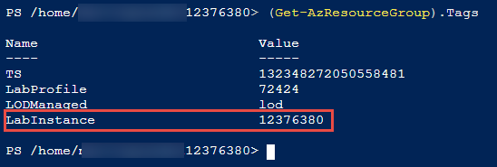

# Azure Access Control Policy Creation Process

This document provides basic information on the steps for creating a restrictive Access Control Policy (ACP) that limits a lab to only the resources it requires.

## Resource data collection

To create a restrictive policy that allows only the resources required for a lab, you must collect and inventory the resources that you create in Azure. To do this, when you get to the end of the lab steps, in the Azure portal,

1.  From the hamburger tab, select All services.  
    

2.  In the All Service search box, enter and select **Resource Explorer**.  
    

3.  In Resource Explorer, expand **Subscriptions**, expand the \[**subscription used in lab**\], expand **ResourceGroups**, expand \[**resource group used in lab**\], and select **Resources**.

4.  Select any area in the Resources pane to the right, and press **Ctrl+A** to select all the content, and then press **Ctrl+C** to copy all the contents to the clipboard.  
      
    

5.  Open a text editor and press Ctrl+V to copy the contents of the clipboard.

6.  If the resources list one or more VMs, select \[Microsoft.Compute/virtualMachines\]\[VMname\]  
    

7.  Make a note of the VM size.

8.  Repeat steps 6 and 7 for each VM in the resource group.

9.  Repeat steps 3 to 8 for each resource group used in the lab, if there are more than one.

10. For each resource group, append the resource information to the text file.

11. Save the text file with a descriptive name, such as **MOC20765C-Mod1-Resources.json**.

## Creating the ACP

The resources you collected earlier allow you to easily create a comprehensive but strict Access Control Policy by using using the model templates provided below and by following a few simple principles:

### Principles for ACP creation

-   Follow the principle of least privilege. In your ACP, explicitly allow ***only*** those resources required to perform the lab. You must follow this principle strictly for Microsoft.Compute resources, but you have some flexibility with other resources (see below).

-   You must **never** use an ACP in production that allows the creation of any and all resources under the Microsoft.Compute node. You must always specify exactly what resources are allowed under this node, for example, Microsoft.Compute/virtualmachines/extensions.

-   For labs that use Azure VMs, you ***must always*** restrict VM creation by SKU and by VM Name, if at all possible. Optionally, you should also restrict by region. Allowing some flexibility for region and SKU selection is permitted, but don't leave it wide open: allow only a handful of SKUs and regions.
    
-  Labs that use Scale Sets and Azure Kubernetes Service (AKS)  cluster pose additional challenges in that it is often not possible to constrain the virtual machines in the Scale Set of AKS cluster by name. In this case, you should try to limit virtual machine instances by naming pattern, capacity,  and/or image offer, where appropriate. Some examples of how to do this are provided below.

    >NOTE: In some cases, you might find that VM names are created by using functions that generate non-deterministic random strings,       making it very difficult to restrict VM creation by name. In this case, as a last-restort compromise, it is acceptable to limit by      SKU and region only --but, only as a last resort and only when accompanied by other measures to mitigate risk.

-   For all other resources, it is acceptable to allow any resource to be created under the parent node. For example, consider a lab that uses the both Microsoft,Network/networkinterfaces and Microsoft.Network/networkSecurityGroups resources. You do not have to explicitly allow both Microsoft.Network/networkinterfaces and Microsoft.Network/networkSecurityGroups. You can simply allow all resources to be created under this node (Microsft.Network).

-   If possible, you should try to restrict resources by SKU if there is a risk of a significant impact if a user chooses a more expensive SKU than required by the lab.

### Creating an ACP for a lab that has no virtual machines

When an ACP does not require that you limit the virtual machine resources, you can use the following template as a model:

```json
{
    "if": {
        "not": {
            "anyOf": [                           
                {
                    "field": "type",
                    "contains": "Microsoft.Storage/storageAccounts"
                },
                {
                    "field": "type",
                    "contains": "Microsoft.Network"
                },
                {
                    "field": "type",
                    "contains": "Microsoft.Sql/servers"
                }
            ]
        }
    },
    "then": {
        "effect": "Deny"
    }
}

```

Examine the text file that contains an inventory of resources you saved earlier, and then replace or add the resources as appropriate to the Json code above.

### Creating an ACP for a lab that has one or more Azure VMs

For labs that use Azure VMs, you ***must*** limit VM creation by name and by SKU (size). As well, you should limit by region. The following JSON provides the basic pattern you can use:

```Json
{
    "if": {
        "not": {
            "anyOf": [
                {
                    "allOf": [
                        {
                            "field": "type",
                            "equals": "Microsoft.Compute/virtualMachines"
                        },
                        {
                            "field": "Microsoft.Compute/virtualMachines/sku.name",
                            "in": [
                                "Standard_B2ms",
                                "Standard_D3_v2",
                                "Standard_DS3_v2"
                            ]
                        },
                        {
                            "field": "Microsoft.Compute/virtualMachines/osprofile.computername",
                            "in": [
                                "WebVM1"
                            ]
                        },
                        {
                            "field": "location",
                            "In": [
                                "eastus2",
                                "eastus"
                            ]
                        },
                        {
                            "field": "location",
                            "notEquals": "global"
                        }
                    ]
                },
            {
            "field": "type",
            "contains": "Microsoft.web/sites"
            },
            {
            "field": "type",
            "contains": "Microsoft.web/serverfarms"
            },
            {
            "field": "type",
            "contains": "Microsoft.Sql/servers"
            },
            {
            "field": "type",
            "contains": "Microsoft.Network"
            },
            {
            "field": "type",
            "contains": "Microsoft.Compute/disks"
            },
            {
            "field": "type",
            "contains": "Microsoft.Compute/virtualMachines/extensions"
            },
            {
            "field": "type",
            "contains": "Microsoft.Storage/storageaccounts"
            },
            {
            "field": "type",
            "contains": "Microsoft.Insights/"
            }
            ]
        }
    },
    "then": {
        "effect": "Deny"
    }
}

```

In this case, the policy allows the creation of only VMs that are named WebVM1 in the East US and East US 2 regions. Further, the user must choose 1 of 3 allowable sizes.


### Limiting resources by SKU, family, capacity, tier

In some cases, it may be desirable to limit a service, for example SQL databases or web apps by by SKU, family, tier, or some other property to prevent abuse. Doing so requires that you use an "allOf" block, similar to the one you use when you limit an Azure VM by name or SKU. 

The following shows an example of limiting a web server farm to a Standard S1 SKU:

```json
{
    "if": {
        "not": {
            "anyOf": [
                {
                "allOf": [
                    {
                    "field": "type",
                    "equals": "Microsoft.web/serverfarms"
                    },
                    {
                    "field": "Microsoft.web/serverfarms/sku.name",
                    "equals": "S1"
                    },
                    {
                    "field": "Microsoft.web/serverfarms/sku.family",
                    "equals": "S"
                    },
                    {
                    "field": "Microsoft.web/serverfarms/sku.capacity",
                    "equals": "1"
                    }
                    ]
                },
                {
                    "field": "type",
                    "contains": "Microsoft.Network/"
                },
                {
                    "field": "type",
                    "contains": "Microsoft.alertsmanagement/"
                },
                {
                    "field": "type",
                    "contains": "Microsoft.insights/"
                },
                {
                    "field": "type",
                    "contains": "Microsoft.Sql/servers/"
                },                
                {
                    "field": "type",
                    "contains": "Microsoft.web/sites"
                }
            ]
        }
    },
    "then": {
        "effect": "Deny"
    }
}

```

## Advanced ACP creation topics

### Using conditions

A condition determines what criteria a field or a value must match to be allowed by the policy. 

Note the use of the condition **in** to limit the VM name to **WebVM**. Because you are limiting the VM to a single name, you could have used the **equals** condition. However, the **equals** condition supports the use of only one string, whereas as the **in** condition supports multiple string values, for example,

```json
{
"field": "Microsoft.Compute/virtualMachines/osprofile.computername",
"in": [
    "WebVM1",
    "WebVM2",
    "WebVM3
 ]
}

```
In the event that you want to create template ACP that you can use for multiple scenarios with little modification, using the **in** condition provides more flexibility for VM name restriction.

The following conditions are supported:

- `"equals": "stringValue"`
- `"notEquals": "stringValue"`
- `"like": "stringValue"`
- `"notLike": "stringValue"`
- `"match": "stringValue"`
- `"matchInsensitively": "stringValue"`
- `"notMatch": "stringValue"`
- `"notMatchInsensitively": "stringValue"`
- `"contains": "stringValue"`
- `"notContains": "stringValue"`
- `"in": ["stringValue1","stringValue2"]`
- `"notIn": ["stringValue1","stringValue2"]`
- `"containsKey": "keyName"`
- `"notContainsKey": "keyName"`
- `"less": "dateValue" | "less": "stringValue" | "less": intValue`
- `"lessOrEquals": "dateValue" | "lessOrEquals": "stringValue" | "lessOrEquals": intValue`
- `"greater": "dateValue" | "greater": "stringValue" | "greater": intValue`
- `"greaterOrEquals": "dateValue" | "greaterOrEquals": "stringValue" | "greaterOrEquals": intValue`
- `"exists": "bool"`

Some conditions will throw errors if used inappropriately. For example, the **less**, **lessOrEquals**, **greater**, and **greaterOrEquals** require that the property type must match the condition type. Consider the following:

```json
{
    "allOf": [
        {
            "field": "type",
            "equals": "Microsoft.Compute/virtualMachineScaleSets"
        },
        {
            "field": "Microsoft.Compute/virtualMachineScaleSets/sku.name",
            "in": [
                "Standard_DS1_v2"
                ]
        },
        {
            "field": "Microsoft.Compute/virtualMachineScaleSets/virtualMachineProfile.storageProfile.imageReference.offer",
            "equals": "aks"
        },
        {
            "field": "Microsoft.Compute/virtualMachineScaleSets/sku.capacity",
            "lessOrEquals": 3
        },
        {
            "field": "location",
            "In": [
                "eastus",
                "eastus2"
                ]
        },
        {
           "field": "location",
           "notEquals": "global"
        }
    ]
 }
```

The above section limits a virtual machine scale set to a maximum of 3 or less virtual machine instances. Note that the value is an integer (**3**), not a string (**"3"**). Using a string in this context would cause an error.

   >NOTE: In the example above the scale set is constrained to AKS clusters only by leveraging the image reference offer property. This provides an additional control to mitigate risk from the creation of resources that are outside of the scope of the lab.

The **match**, **matchInsensitively**, **notMatch**, and **notMatchInsenstively** use `#` to match a digit, `?` a letter, and `.` to match any character and can can provide needed flexibilty. However, the match conditions should be used with caution, especially with regard to virtual machine names. For example, this expression would allow the creation of 1000 virtual machines named WinVM-000 to WinVM-999.

```json
{
    "field": "Microsoft.Compute/virtualMachines/osprofile.computername",
     "matchinsensitively": "WinVM-###"
}
```
This said, dependending on the context, using the match conditions does provide another element of control. Consider this snippet which is used to restrict the allowed names for virutual machines that are created as part of an Azure Kubernetes Service (AKS) cluster. It is not possible to determine the specific names in advance; however, it may be possible to determine the naming pattern and use that as the restricting principle. 

```json
{
    "field": "Microsoft.Compute/virtualMachines/osprofile.computername",
     "matchinsensitively": "aks-agentpool-########-#"
}
```

### Using functions

With some exceptions, all the [Azure Resource Manager functions](https://docs.microsoft.com/en-us/azure/azure-resource-manager/templates/template-functions) are available for use in Azure policy rules.

The use of functions is particularly useful in cases where the lab author either creates resources or asks users to create resources which use names that are a combination of a string and some generated, deterministic value. Examples of generated, deterministic values include the lab instance ID or apparently unique strings created by the [uniqueString function](https://docs.microsoft.com/en-us/azure/azure-resource-manager/templates/template-functions-string#uniquestring).

Consider a scenario where a lab author uses an Azure Resource Manager (ARM) template to deploy a virttual machine. In the ARM template, the lab author specifies the name of the virtual machine as a combination of a text string plus a unique string based on the resource group ID as follows:

```
[concat('wvm', uniqueString(resourceGroup().id))]
```

You can use the same function in the policy rule, since the uniqueString function generates a deterministic name from a hash of the resource group ID. The following policy rule statment shows how you can craft a policy statement that restricts VM resource creation to that specific name, even though you do not know in advance what the unique string is.

```
{
    "field": "Microsoft.Compute/virtualMachines/osprofile.computername",
    "in": [
        "[concat('wvm', uniqueString(resourceGroup().id))]"
        ]
}
```

Or, consider a scenario where a lab author asks users to create VMs that are a combination of a text string plus the lab instance ID. In the raw markdown for the lab instruction, the instruction might be something like this:

```
Create two virtual machines named vmweb@lab.labInstance.id and vmapp@lab.labInstance.id. 
```

The lab instance ID is added to the resource group properities as a tag. 

   


You can, therefore, use the following policy rule statement to restrict the VM names to the ones requested by the lab instructions as follows:

```json
{
    "field": "Microsoft.Compute/virtualMachines/osprofile.computername",
    "in": [
        "[concat('vmweb',resourcegroup().tags.LabInstance)]",
        "[concat('vmapp',resourcegroup().tags.LabInstance)]"
         ]
}
```

### Other resources

- Additional guidance from LODS: <a href = "https://github.com/LearnOnDemandSystems/labauthor/tree/master/access-control-policies"  target="_blank">What are Access Control Policies?</a>.

- Public ACPs you can use immediately: [Managed ACPs](https://labondemand.com/AccessControlPolicy#%7B%22PageIndex%22%3A0%2C%22PageSize%22%3A%2220%22%2C%22Sort%22%3A%22Name%22%2C%22Filters%22%3A%5B%7B%22Name%22%3A%22CloudPlatformId%22%2C%22Value%22%3A%2210%22%2C%22ComparisonType%22%3A%220%22%2C%22Text%22%3A%22%22%7D%2C%7B%22Name%22%3A%22RequiresSecurityReview%22%2C%22Value%22%3A%220%22%2C%22ComparisonType%22%3A%22-1%22%2C%22Text%22%3A%22%22%7D%2C%7B%22Name%22%3A%22Public%22%2C%22Value%22%3A%220%22%2C%22ComparisonType%22%3A%220%22%2C%22Text%22%3A%22%22%7D%5D%2C%22OutputOptions%22%3A%5B%22Name%22%2C%22Organization%22%2C%22CloudPlatformId%22%2C%22RequiresSecurityReview%22%5D%2C%22TimeZoneId%22%3A%22Eastern%20Standard%20Time%22%7D "Managed ACPs")

- Examples of restrictive ACPs: <a href="https://labondemand.com/AccessControlPolicy#%7B%22PageIndex%22%3A0%2C%22PageSize%22%3A%2220%22%2C%22Sort%22%3A%22Name%22%2C%22Filters%22%3A%5B%7B%22Name%22%3A%22Name%22%2C%22Value%22%3A%22lockdown%22%2C%22ComparisonType%22%3A%2210%22%2C%22Text%22%3A%22%22%7D%2C%7B%22Name%22%3A%22CloudPlatformId%22%2C%22Value%22%3A%22-1%22%2C%22ComparisonType%22%3A%220%22%2C%22Text%22%3A%22%22%7D%2C%7B%22Name%22%3A%22RequiresSecurityReview%22%2C%22Value%22%3A%220%22%2C%22ComparisonType%22%3A%22-1%22%2C%22Text%22%3A%22%22%7D%5D%2C%22OutputOptions%22%3A%5B%22Name%22%2C%22Organization%22%2C%22CloudPlatformId%22%2C%22RequiresSecurityReview%22%5D%2C%22TimeZoneId%22%3A%22Eastern%20Standard%20Time%22%7D" target="_blank">ACP Examples</a>. 

- Microsoft ACP documentation:
   - <a href="https://docs.microsoft.com/en-us/azure/governance/policy/samples/" target="_blank">Micrsoft ACP Samples</a>
   - <a href="https://docs.microsoft.com/en-us/azure/governance/policy/concepts/definition-structure#conditions">Policy Definition Structure: conditions</a>
   - <a href="https://docs.microsoft.com/en-us/azure/governance/policy/concepts/definition-structure#aliases">Aliases</a>
