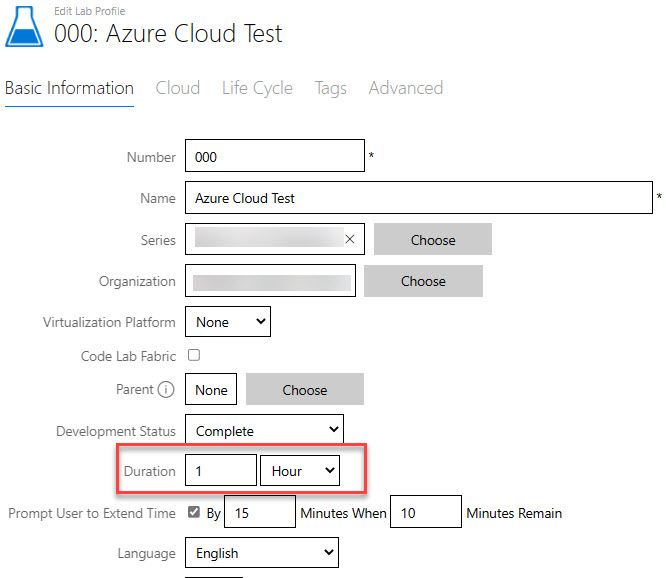
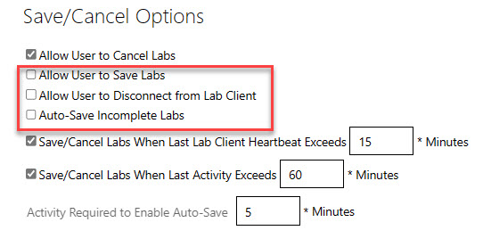
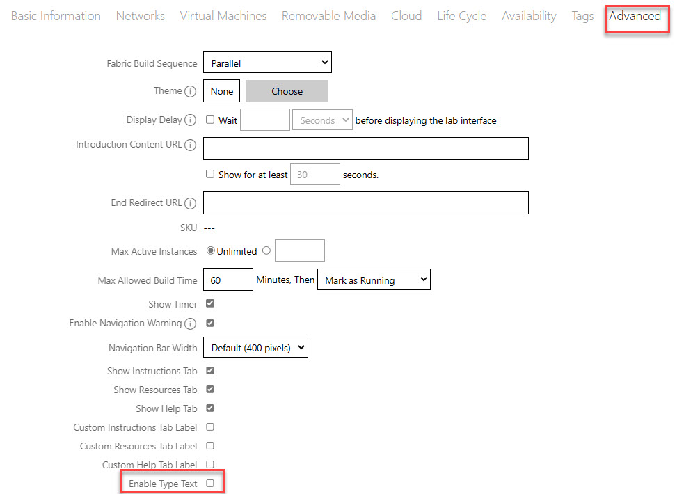

# Security Best Practices

Skillable is commited to ensuring a high degree of security on our platform. With this in mind, customers should also be aware that some configurations 
may not have an optimal security posture for particular audiences or industries. For high security industries, such as banking or finance, or for those 
customers who want to ensure as high a degree as security as possible, this document provides recommendations and explanations of some of the best practices 
you should follow when creating labs on the Skillable platform.

# All Lab Types

Whenever possible, follow the principle of least privilege. Do not provide lab users with more resources or permissions than they require. 

Lab design can play a critical role here. For example, if you are creating a clould based lab that connects to Azure or AWS virtual machines and you do not allow otbound RDP or SSH access from your corporate network, consider creating a jump-box virtual machine on Hyper-V or ESX in one of the Skillable datacenters. Combined with other settings you can enable, you can better control what traffic leaves your network by using a jump box. 

## Limit lab duration

On the [Basic Infromation](https://docs.learnondemandsystems.com/lod/feature-focus/lab-profiles/create.md#basic-information) tab of the lab profile properties page, ensure that the lab duration is sufficent only to allow most users to complete 
the lab comfortably. 

## Limit ability to Save/Cancel labs

In the absence of a need for the functionality, ensure you have disabled the option to Save labs. In particular, **disable** these options.

 - Allow user to Save Labs
 - Allow User to Disconnect from Lab Client
 - Auto-Save Incomplete Labs

You can find these options on the Advanced tab of the lab profile property page. 

## Disable or limit authenticated launch links

On the Advanced tab of the lab profile properties, you are able to give access to accounts that use a variety of authentication providers. These include Microsoft and Gmail accounts. 

You should use authenticated launch links only when absolutely necessary for testing purposes. Furthermore, you should limit these links to expire 
after a set period or remove them when the testing period has completed. 

# VM Based Labs

## If necessary, disable Type Text

In very high security environments, such as in the financial industry, it may be desirable to prevent users from being able to copy any information from 
the clipboard of the local computer to the virtual machine. To prevent copying and pasting from the local device to the lab virtual machine, you can disable the Type Text option on the Advanced tab of the lab profile properties page. This will remove the Type Text menu option on the Commands menu. For more information on the Commands menu option, see [Commands menu](https://docs.learnondemandsystems.com/lod/lab-interface.md#commands-menu). 

You can find the setting to remove the Commands menu option on the Advanced tab of the lab profile properties page:

 >NOTE: Disabling the Type Text menu option does not disable the ability to use the Type Text feature to copy text strings from the lab manual to the virtual 
machine. Disabling the Type Text menu option will also disable the ability to redirect the clipboard for virtual machines that have Enhanced Session Mode (ESM) enabled. For information on ESM, see [Create a Virtual Machine Profile ](https://docs.learnondemandsystems.com/lod/vm-profiles.md#hyper-v-1)

## Disable or restrict Internet access

Skillable incorporates a number of controls to ensure network stability and security. You can find an overview of these controls here: 
[Lab Network Restrictions](https://docs.learnondemandsystems.com/lod/lab-networks.md)

You control whether or not virtual machines have Internet access. If Internet access is not required on a virtual machine, you should not enable it. 
If a virtual machine does require Internet access and you have a concern that it could be used to bypass your corporate policies, you can attach an 
Access Control List (ACL) to the lab profile to ensure only a subset of authorized web sites are accessible. It is recommended that you create an Allow list that 
blocks all web sites except those you explicitly authorize.

For information on configuring Internet access in a lab profile, see the documentation on creating [networks](https://docs.learnondemandsystems.com/lod/feature-focus/lab-profiles/create.md#networks)

For information on configuring Access Control Lists to restrict Internet access, see the documentation on [Access Control Lists](https://docs.learnondemandsystems.com/lod/access-control-lists.md)
 
# Cloud Slice Labs 

The Skillable platform allows you to integrate subscriptions from other cloud providers such as AWS or Azure. When you integrate your cloud subscription with our platform, we take a number of measures to mitigate abuse. For example, in Azure subscriptions that are integrated with our platform, we create custom roles for the labs users that limit their ability to perform certain activities, such as purchase services in the Azure market place or invite guest users. For AWS integration, we implement permissions boundaries to limit the activities of lab users.

That said, these are only initial controls. If you are integrating your cloud subscription with the Skillable platform, there are a number of steps you must take to enhance security and mitigate the risk of abuse.

> [!Alert] Skillable makes good faith efforts to help minimize customer risk and to help prevent abuse of cloud subscriptions. However, given the rapidly evolving threat environment and other unknown factors, Skillable can make no warranties regarding the elimination or mitigation of risk. Skillable customers who integrate their subscriptions with the lab platfrom and wish to publish labs are responsible for making the final determination whether the risk level is acceptable.

## Use a separate cloud subscription for integration with our platform

You should not use the same tenant/subscriptions and billing account that use in a production environment. Furthermore, if possible, you should set billing caps on your subscriptions that throttle usage after certain thresholds are triggered. 

## For Azure tenants, limit external collaboration settings
By default, when you integrate your Azure subscription with our platform, we change the collaboration settings to restrict guest access to your dedicated tenant. You can find these settings in the Azure portal by navigating to Default Directory | Users > Users | User Settings > External collaboration settings.  

You should not modify the collabortion settings on this page. These settings are necessary to protect your subscription from lab users who may invite external users to gain unauthorized access to resources in the subscription. Although we do have automation to check these settings on a periodic basis and reset them if necessary, this check does not occur on every lab lab launch. 

## Do not use Life Cycle Actions (LCA) to modify permissions in the cloud subscription

LCAs can run scripts against your lab environment in the security context of the account you provided to enable integration with the Skillable platform.
Consequently, these scripts are capable in some cases of changing permissions and roles that are otherwise not available in the lab environment. 
In most cases, using an LCA to modify the role of the lab user in the subscription would cause the lab to fail a security review. However, if the 
role is benign, the lab could potentially pass a security review. That said, if you have to add more permissions to a cloud subscription in 
order to perform the lab steps, you should consider whether the increased risk is justified. 

## Restrict guest invitations (Azure)

By default, Azure Active Directory allows you to invite guests from other domains. You should change this setting to prevent lab users from 
inviting unauthorized accounts to access the lab resources in your cloud subscription. 

## Ensure Access Control Policies (ACPs) are as restrictive as possible

When creating Access Control Policies for labs, ensure that the ACPs allow the creation of only the resources that are required to 
complete the lab. For more information on ACPs and related topics, see [Cloud Security & Best Practices](https://docs.learnondemandsystems.com/lod/cloud-security/cloud-security-home.md). 

[Back to top.](#security-best-practices)
